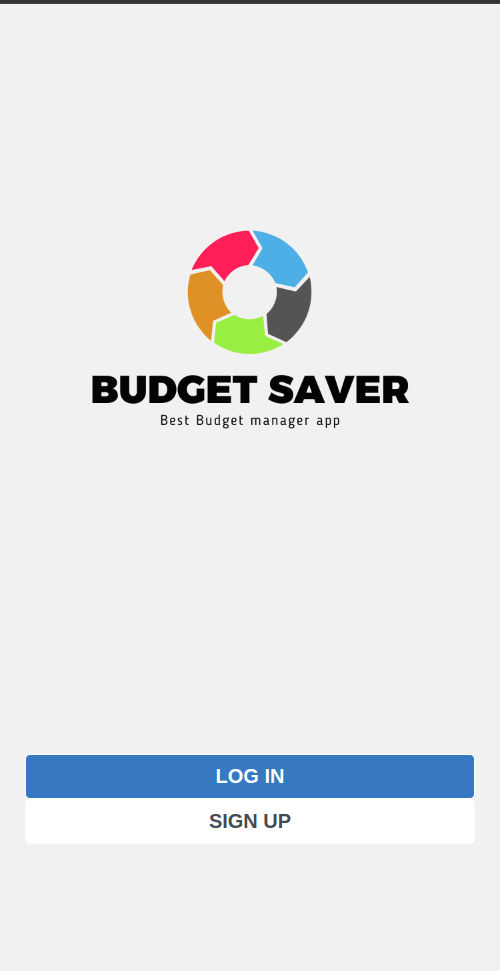
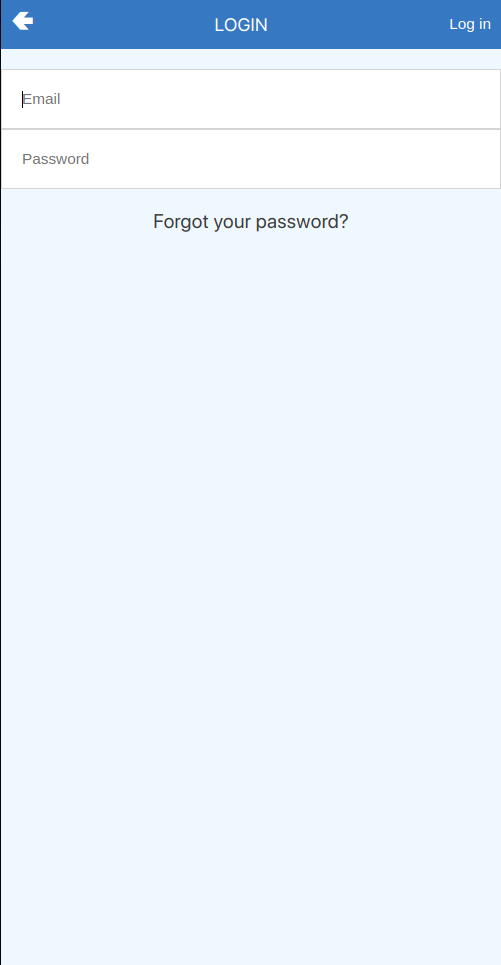
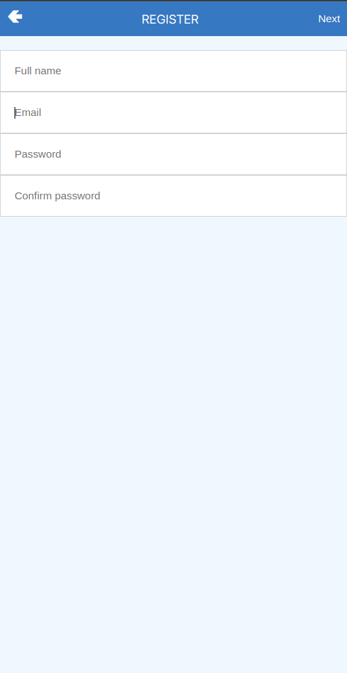
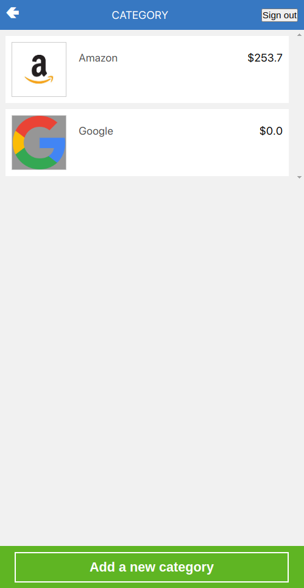
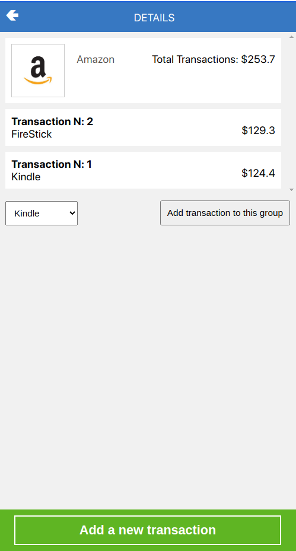
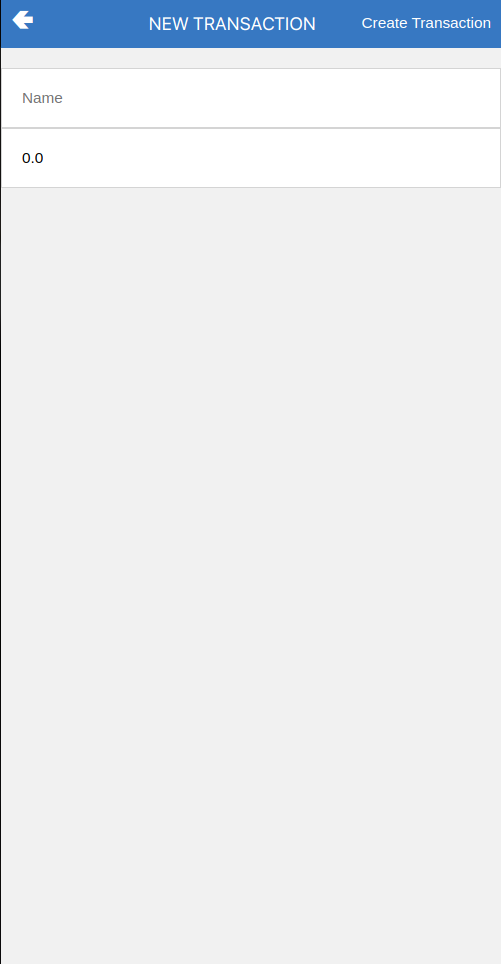

# Budget saver

This app keps track of all your transctions

## Table of Contents

- [Built with](#built-with)
- [Live app](#live-demo)
- [Prerequisites](#prerequisites)
- [Getting Started](#getting-started)
- [Contributing](#🤝-contributing)

## Built With

- [Ruby](https://www.ruby-lang.org/)
- [Rails](https://rubygems.org/gems/rails)
- [Postgresql](https://www.postgresql.org/)

## Live Demo

- [✨Budget Saver](https://budget-saver-app.herokuapp.com/)










## Prerequisites

For using the app you can use the Demo link above to see the app in action, no further prerequisites are needed.

## Developments

You should have `ruby on rails` and `postgresql` installed and running on your machine before you can start developing this app.

### Getting Started

To start using this software you need to have Ruby installed in your machine
Then clone this repo:

```
-$ git clone git@github.com:Ismailco/budget-saver.git
```

```
-$ cd budget-saver
```

Then install the gems:

```
-$ bundle install
```

Then run the server:

```
-$ rails server
```

Then visit the URL:

```
-$ http://localhost:3000
```

To run rspec, in your terminal for testing the methods:

```
-$ rspec
```


## Authors

👤 **Ismail Courr**

- GitHub: [@ismailco](https://github.com/ismailco)
- Twitter: [@ismailcourr](https://twitter.com/ismailcourr)
- LinkedIn: [Ismail courr](https://www.linkedin.com/in/ismailcourr)

## Credits

- Original design idea by [Gregoire Vella](https://www.behance.net/gregoirevella) on Behance.

## 🤝 Contributing

Contributions, issues, and feature requests are welcome!

Feel free to check the [issues page](../../issues/).

## Show your support

Give a ⭐️ if you like this project!

## 📝 License

This project is [MIT](./LICENSE) licensed.
